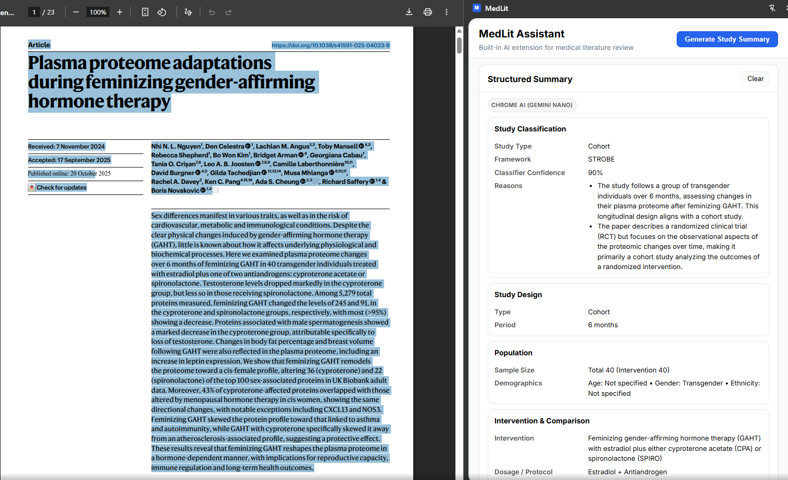
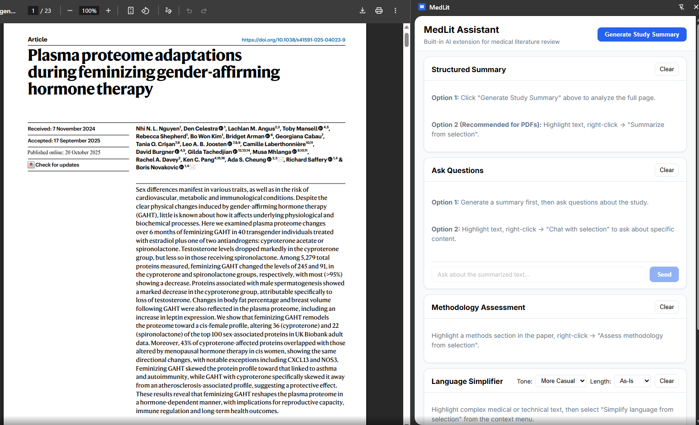
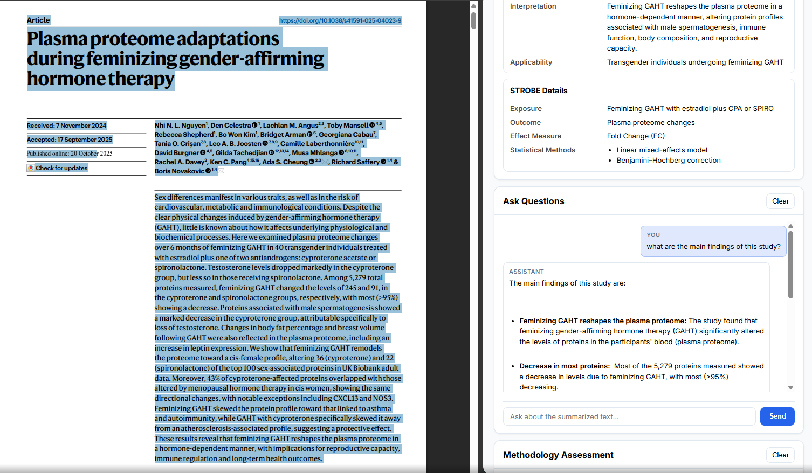
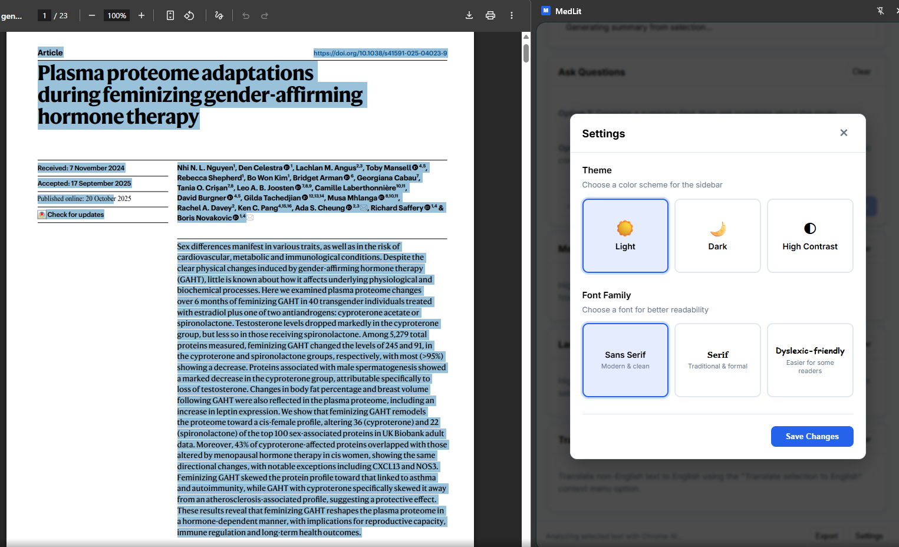
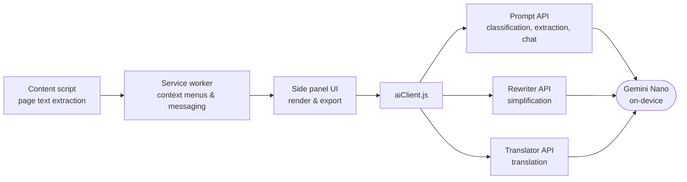

<div align="center">


# MedLit

**On-device AI assistant for medical literature review, built entirely on Chrome's built-in AI.**

[](LICENSE)
[](https://developer.chrome.com/docs/ai/built-in)
[](manifest.json)
[](https://developer.chrome.com/docs/ai/built-in)
[](src/)
[](https://devpost.com/software/medlit)

</div>

---

MedLit is a Chrome extension that turns the browser into a privacy-preserving research assistant for medical literature. It extracts structured study summaries, scores methodology quality, simplifies clinical jargon, translates abstracts, and answers questions about papers in a chat interface - all processed locally with Gemini Nano. No data ever leaves the browser.

Built for the [Google Chrome Built-in AI Challenge 2025](https://googlechromeai2025.devpost.com/) ([Devpost submission](https://devpost.com/software/medlit)).

<div align="center">

<p><em>Framework-aligned structured summary: study classification with confidence and reasoning, design, population, and intervention details extracted on-device.</em></p>
</div>

## Why

Clinicians, trainees, and researchers spend hours manually extracting study design elements from papers and judging their quality. Cloud-based AI tools require pasting potentially sensitive documents into external services. MedLit solves both problems with a browser-native, reporting-framework-aware assistant that works offline and keeps every token on-device.

## Features

- **Structured summary extraction** - Classifies papers into 12 study types (RCT, Cohort, Systematic Review, Diagnostic Accuracy, ...) and applies the matching reporting framework (CONSORT, PRISMA, STROBE, STARD, CARE, COREQ) to extract PICO elements, demographics, outcomes, and effect sizes.
- **Methodology quality assessment** - Scores methods sections against the Cochrane Risk of Bias dimensions (1-5 scale across 5 domains) with a confidence-weighted overall score (0-100). Content is pre-validated before scoring to avoid garbage-in-garbage-out.
- **Jargon simplification** - Rewrites technical passages with the Rewriter API using medical domain context, with adjustable tone and length and key-term definitions.
- **Translation** - Translates abstracts via the Translator API, falling back to the Prompt API for unsupported language pairs.
- **Contextual chat** - Ask follow-up questions about the generated summary or any selected text, with markdown-rendered answers and token-limit warnings.
- **Export** - Save summaries, assessments, simplified text, translations, and chat logs as Markdown or JSON.
- **Accessibility** - Light/dark/high-contrast themes, dyslexia-friendly font option, and adjustable character size and spacing.

Every feature is reachable from the side panel or a right-click context menu ("MedLit" > "Summarize from selection", "Assess methodology from selection", etc.).

## Screenshots

<table>
  <tr>
    <td align="center">
      
      <em>Side panel with summary, chat, methodology, and simplifier tools</em>
    </td>
    <td align="center">
      
      <em>STROBE-specific extraction and contextual chat about the paper</em>
    </td>
  </tr>
  <tr>
    <td colspan="2" align="center">
      
      <em>Theme and accessibility settings: light/dark/high contrast, dyslexia-friendly fonts</em>
    </td>
  </tr>
</table>

## How it works



1. A **decision-tree classifier prompt** with explicit anti-hallucination rules identifies the study type first (e.g. preventing RCTs from being misclassified as systematic reviews just because the introduction cites one).
2. The detected type selects a **framework-specific extraction template**, so an RCT is summarized against CONSORT while a meta-analysis is summarized against PRISMA.
3. Model output is **normalized and validated** before rendering - enum coercion, confidence thresholds, and keyword-based inference recover usable results from ambiguous responses.
4. The Rewriter and Translator APIs are primary for their tasks, with **structured Prompt API fallbacks** so features degrade gracefully instead of failing.

## Tech stack

- **Chrome Built-in AI APIs only** - Prompt API (`LanguageModel`), Rewriter API, Translator API. No external services, no API keys.
- **Vanilla JavaScript (ES6 modules)** - roughly 4,000 lines, zero framework, zero build step. Load unpacked and it runs.
- **Manifest V3** - service worker background, side panel, content script.
- **marked.js** (bundled, MIT) for markdown rendering in chat.

```
src/
├── ai/
│   ├── aiClient.js          # API sessions, classification, normalization
│   ├── promptTemplates.js   # Framework-specific extraction prompts
│   ├── validators.js        # Content pre-validation
│   └── fallbacks.js         # Graceful degradation strategies
├── background/
│   └── serviceWorker.js     # Context menus & message routing
├── content/
│   └── contentScript.js     # Page text extraction
├── sidepanel/
│   ├── index.html / main.js / render.js / styles.css
│   └── lib/marked.min.js
└── shared/
    ├── constants.js
    └── messaging.js
```

## Getting started

### Prerequisites

- **Chrome 138+** (Stable, Dev, or Canary)
- **OS**: Windows 10/11, macOS 13+, Linux, or ChromeOS (Chromebook Plus)
- **Storage**: at least 22 GB free on the Chrome profile volume (the Gemini Nano model itself is smaller; Chrome removes it if free space drops below 10 GB)
- **Hardware**: GPU with more than 4 GB VRAM, or 16 GB+ RAM with 4+ CPU cores
- **Chrome flags** enabled:
  - `chrome://flags/#optimization-guide-on-device-model`
  - `chrome://flags/#prompt-api-for-gemini-nano`
  - `chrome://flags/#rewriter-api`
  - `chrome://flags/#translation-api`

### Install

1. Clone this repository
2. Open `chrome://extensions` and enable **Developer mode**
3. Click **Load unpacked** and select the `medlit` folder
4. Open any medical paper (PubMed, PMC, journal site) and click the MedLit icon

First use triggers the Gemini Nano model download; MedLit shows download progress in the side panel.

## Usage

1. Navigate to a research paper and open the side panel
2. **Full summary**: click "Generate Study Summary"
3. **Methodology check**: highlight the Methods section, right-click > "Assess methodology from selection"
4. **Simplify / translate**: highlight any passage, right-click > "Simplify language" or "Translate selection to English"
5. **Chat**: after generating a summary, ask questions in the Chat tab
6. **Export**: download any result as Markdown or JSON

## Limitations

- Chrome's PDF viewer limits full-page text extraction; selecting text and using the context menu works best on PDFs.
- Chat contexts above ~4,000 characters trigger warnings; ~2,000 characters is the practical sweet spot for Gemini Nano.
- Study type detection is heuristic-assisted; anti-hallucination rules reduce but do not eliminate misclassification.

## License

[MIT](LICENSE)

Bundles [marked.js](https://github.com/markedjs/marked) v15.0.12 (MIT, Copyright (c) 2011-2025 Christopher Jeffrey) locally for offline support.

## Acknowledgements

- The Chrome Built-in AI team for the APIs and documentation
- Devpost and Google for hosting the Chrome Built-in AI Challenge 2025
- Medical professionals who gave feedback on usability and features
